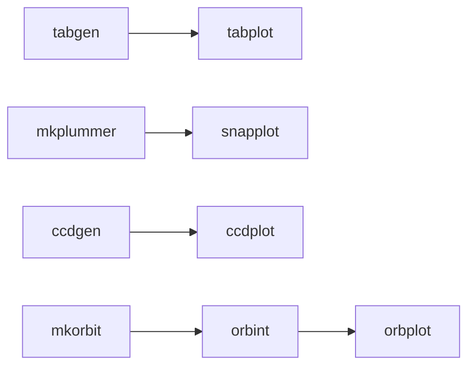
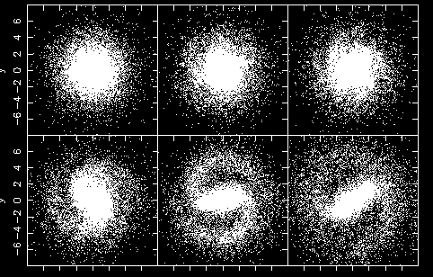

NEMO is a toolbox for stellar dynamics, particle simulations, stellar orbits,
image processing and tabular data manipulation. Documentation is maintained
in the github pages, https://teuben.github.io/nemo

## History

This is the 4th major release of NEMO,  and although data are compatible
with earlier releases, old source code may need to be tweaked a
bit to compile and link in the newer releases. Some compatibility with ZENO
is also advertised. A brief history of NEMO:

   * NEMO V1:	IAS release (Barnes, Hut & Teuben, 1987)
   * NEMO V2:	UMD release (Teuben, 1994)
   * NEMO V3:	UMD release (Teuben, 2001) in CVS, with autoconf support and
		hooks into manybody.org modules starlab and partiview
   * NEMO V4:   UMD/ESO release (2017) now maintained in github

A related package, ZENO, was spun off NEMO V1, and is maintained by Josh Barnes. 
Other packages that geneologically came after NEMO are StarLab, ACS and AMUSE
(see also https://ascl.net for code references):

	 NEMO:      ascl:1010.051
	 ZENO:      ascl:1102.027 (normally installed in $NEMO/usr/zeno)
	 STARLAB:   ascl:1010.076
	 ACS:       https://artcompsci.org
	 AMUSE:     ascl:1107.007
	 
## Optional Packages

Packages we optionally use (sometimes also installed in $NEMO/opt with source code in $NEMO/local):

	 PGPLOT:    ascl:1103.002
	 CFITSIO:   ascl:1010.001
	 WCSLIB:    ascl:1108.003
	 glnemo2:   ascl:1110.008
	 gyrfalcON: ascl:1402.031 (included with NEMO)
	 HDF4
	 HDF5       https://www.hdfgroup.org
	 netcdf4
	 gsl
	 plplot
	 unsio
	 uns_project
	 wcstools

Tools you will need to have pre-installed: the C/C++/Fortran
compilers, (t)csh, and git.  For graphics it's probably useful to have
pgplot, but the default ps driver works fine just to get started.
We are looking for more portable full graphics, as an alternative
to pgplot.

The files in $NEMO/src/scripts/linux describe the actual package
names for different linux distros that should lead to success.

## Installation

There are a few different ways to install NEMO, here is a basic
example that works most of the time on most Linux distros (assuming
you have the preconditions):

         git clone https://github.com/teuben/nemo
         cd nemo
         ./configure --with-yapp=pgplot
         make build check bench5
         source nemo_start.sh

If you plan to modify code and submit pull requests, the github CLI is recommended,
though you can of course also clone the upstream manually (see also [CONTRIBUTING.md](CONTRIBUTING.md)):

         gh repo fork https://github.com/teuben/nemo

On the most recent apple controlled hardware, with SIP enabled, you might be in for a rude
awakening. I use brew on a mac, and assuming you have gcc-10 (and related) and pgplot installed, this should
work (there may be other ways to install tools on a mac, but don't get me started):

         git clone https://github.com/teuben/nemo
         cd nemo
         CC=gcc-10 CXX=g++-10 FC=gfortran-10 ./configure --disable-shared --with-yapp=pgplot
         make build check bench5
         source nemo_start.sh

After installation, rebuilding NEMO to ensure you have all updates can be done as follows:

         cd $NEMO
         git pull
         make rebuild

### python

There is now a small python component to NEMO, in the **nemopy** module.

         cd $NEMO
         pip install -e .

but this will depend on the details of how your python environment exists (virtual, conda etc.).
We leave this to the user.
		 
## Examples		 

If you want to quickly see something work, here are the commands to
make a classic 1911 Plummer sphere of just 10 particles, print the positions, plot
the positions and view the contents of its binary file:

         mkplummer p10.dat 10
         snapprint p10.dat
         snapplot p10.dat
         tsf p10.dat

and here is an example of creating the 4 major data objects on the fly in NEMO
(table, snapshot, image, orbit), showing off the command line interface and
use of Unix pipes, with a dash denoting the piped file:

         tabgen -  | tabplot -
         mkplummer - 100 | snapplot - 
         ccdgen out=- object=gauss spar=1,20 size=128 | ccdplot - 
         mkorbit - 0 1 0  0.4 0 0 potname=plummer | orbint - - nsteps=1000 dt=0.05 | orbplot - 

or graphically

There are more examples of scripts and figures in
https://teuben.github.io/nemo/examples/ 
and an example ipython notebook is shown here
https://github.com/teuben/nemo/blob/master/nemo_start_example.ipynb
for something completely different.

A reproducable example is given in this notebook. To run this from the command line
and print the phase space coordinates of the first particle, use this:

      mkplummer - 10 seed=123| snapprint -  | head -1
      ### nemo Debug Info: x y z vx vy vz 
      -0.609486 -0.221687 -0.450963 -0.0766784 -0.209397 0.396561 

## Documentation and Help

There are several additional entry points if you are starting out with NEMO:

* readthedocs: https://astronemo.readthedocs.io/en/latest/
* github pages: https://teuben.github.io/nemo
* software carpentry: https://teuben.github.io/nemo-lesson 
* contributing to NEMO: https://github.com/teuben/nemo/blob/master/CONTRIBUTING.md

## Citation

Please use the following citation if you use NEMO in your work

     @INPROCEEDINGS{1995ASPC...77..398T,
            author = {{Teuben}, P.},
             title = "{The Stellar Dynamics Toolbox NEMO}",
         booktitle = {Astronomical Data Analysis Software and Systems IV},
              year = 1995,
            editor = {{Shaw}, R.~A. and {Payne}, H.~E. and {Hayes}, J.~J.~E.},
            series = {Astronomical Society of the Pacific Conference Series},
            volume = {77},
             month = jan,
             pages = {398},
            adsurl = {https://ui.adsabs.harvard.edu/abs/1995ASPC...77..398T},
           adsnote = {Provided by the SAO/NASA Astrophysics Data System}
     }

