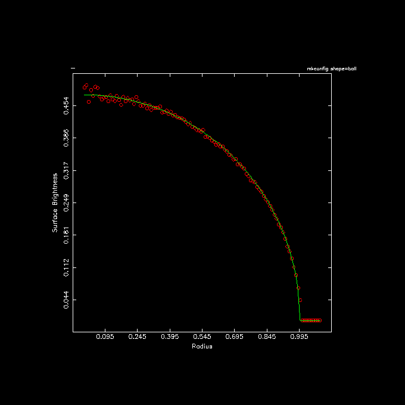

.. _examples:

Examples (*)
============

Now that we have a reasonable idea how NEMO is structured and used, we
should be ready to go through some real examples Some of the examples
below are short versions of scripts available online in one of the
directories (check ``$NEMO/scripts`` and ``$NEMOBIN``).  The manual
pages *programs(8NEMO)* and *intro(1NEMO)* are useful to find (and
cross-reference) programs if you're a bit lost. Each program manual
should also have some references to closely related programs,
in the "SEE ALSO" section.

N-body experiments
------------------

In this section we will describe how to set up an N-body experiment, run,
display and analyze it.  In the first example, we shall set up a head-on
collision between two spherical "galaxies" and do some simple analysis.

Setting it up
~~~~~~~~~~~~~

In :ref:`filestr` we already used ``mkplummer`` to create a Plummer model;
so here we shall use the program ``mkommod``
(*"MaKe an Osipkov-Merritt MODel"*) 
to make two random N-body realizations of a King model 
with dimensionless central potential :math:`W_c = 7` and 100 particles each. 
The small number of particles is solely for the purpose of getting
results within a reasonable time. Adjust it to whatever you can afford
on your CPU and test your patience and integrator.

.. code-block::

    1% mkommod in=$NEMODAT/k7isot.dat out=tmp1 nbody=100 seed=123
              

These models are produced in so-called RMS-units in which the
gravitational constant :math:`G=1`, the total mass :math:`M=1`, and binding energy
:math:`E=-1/2`.
In case you would like virial units (also known as N-body units)
(see also:
Heggie & Mathieu, :math:`E=-1/4`,
in: *The use of supercomputers in stellar
dynamics* ed. Hut & McMillan
Springer 1987, pp.233)
the models have
to be rescaled using ``snapscale``:

.. code-block::

    2% snapscale in=tmp1 out=tmp1s rscale=2 "vscale=1/sqrt(2.0)"

Note the use of the quotes in the expression, to prevent the shell to
give special meaning to the parenthesis, which are shell **meta**
characters.

The second galaxy is made in a similar way, with
a different seed (the default seed=0 takes the time of the day):

.. code-block::

    3% mkommod in=$NEMODAT/k7isot.dat out=tmp2 nbody=100 seed=987

This second galaxy needs to be rescaled too, if you want virial units:

.. code-block::

    4% snapscale in=tmp2 out=tmp2s rscale=2 "vscale=1/sqrt(2.0)"

We then set up the collision by stacking the two snapshots, albeit with
a relative displacement in phase space.  The program ``snapstack`` was exactly
written for this purpose:

.. code-block::

    5% snapstack in1=tmp1s in2=tmp2s out=i001.dat deltar=4,0,0 deltav=-1,0,0

The galaxies are initially separated by 4 unit length and approaching
each other with a velocity consistent with infall from infinity
(parabolic encounter). The particles assembled in the data file
``i001.dat`` are now ready to be integrated.

To look at the initials conditions we could use:

.. code-block::

    6% snapplot i001.dat xrange=-5:5 yrange=-5:5

which is displayed in Figure X

Integration using hackcode1
~~~~~~~~~~~~~~~~~~~~~~~~~~~

We then run the collision for 20 time units, with the standard
N-body integrator based on the Barnes  "hierarchical tree" 
algorithm:

.. code-block::

    7% hackcode1 in=i001.dat out=r001.dat tstop=20 freqout=2 \
       freq=40 eps=0.05 tol=0.7 options=mass,phase,phi > r001.log

The integration frequency relates to the integration timestep as
``freq=40``, the softening length ``eps=0.05``, and
opening angle or tolerance ``tol=$\theta$``.  A major output of
masses, positions and potentials of all particles is done every
``1/freqout = 0.5`` time units, which corresponds to about 1/5 of a
crossing time.  The standard output of the calculation is diverted to a
file ``r001.log`` for convenience.  This is an (ASCII) listing,
containing useful statistics of the run, such as the efficiency of the
force calculation, conserved quantities etc.  Some of this information
is also stored in diagnostic sets in the structured binary 
output file ``r001.dat``. 

As an exercise, compare the output of the following two commands:

.. code-block::

    8% more r001.log
    9% tsf r001.dat | more

Display and Initial Analysis
~~~~~~~~~~~~~~~~~~~~~~~~~~~~

As described in the previous subsection, ``hackcode1`` writes various
diagnostics
in the output file. A summary of conservation of energy and center-of-mass
motion can be graphically displayed using ``snapdiagplot``:

.. code-block::

    10% snapdiagplot in=r001.dat

The program ``snapplot`` displays the evolution of the particle
distribution, in projection (in the **yt** package this is called
a phase plot):

.. code-block::

    11% snapplot in=r001.dat

Depending on the actual graphics (*yapp*) interface snapplot
was compiled with, 
you may have to hit the RETURN key, push a MOUSE BUTTON or just
WAIT to advance from one to the next frame.

The ``snapplot`` program has a very powerful tool built into it
which makes it possible to display any *projection* the user wants.

As an example consider:

.. code-block::

    12% snapplot in=r001.dat xvar=r yvar="x*vy-y*vx" xrange=0:10 yrange=-2:2 \
                 "visib=-0.2<z&z<0.2&i%2==0"

    
plots the angular momentum of the particles along the :math:`z` axis,
:math:`J_z = x.v_y - y.v_x` ,
against their radius, :math:`r`, but only for the even numbered particles,
(``i%2==0``) within
a distance of ``0.2`` of the X-Y plane (:math:`-0.2<z \& z<0.2`).
Again note that some of the expressions are within quotes, to prevent
the shell of giving them a special meaning. 

The ``xvar``, ``yvar`` and ``visib`` expressions are fed to the
C compiler (during runtime!) and the resulting object file is then
dynamically loaded into the program for 
execution.
The expressions must contain legal C expressions and depending
on their nature must return a value in the context of the
program. *E.g.* ``xvar`` and ``yvar`` must return a 
real value, whereas ``visib`` must return a boolean (false/true or
0/non-0) value. This should be explained in the manual page of the
corresponding programs.

In the context of snapshots, the expression can contain 
basic body variables which
are understood to the *bodytrans(3NEMO)* routine.
The real
variables ``x, y, z, vx, vy, vz`` are the cartesian phase-space
coordinates, ``t`` the time,
``m`` the mass, ``phi`` the potential,
``ax,ay,az`` the cartesian acceleration and ``aux``
some auxiliary information.
The integer variables are
``i``, the index of the particle in the snapshot (0 being the
first one in the usual C tradition) and ``key``, another
spare slot.

For convenience a number of expressions have already been pre-compiled
(see also Table \ref{t:bodytrans}),
*e.g.* the radius  r= :math:`\sqrt{x^2+y^2+z^2}` = ``sqrt(x*x+y*y+z*z)``,
and velocity v = :math:`\sqrt{v_x^2+v_y^2+v_z^2}` = ``sqrt(vx*vx+vy*vy+vz*vz)``. Note that ``r`` and
``v`` themselves cannot be used in expressions, only the basic
body variables listed above can be used in an expression. 

When you need a complex expression that has be used over and
over again, it is handy to be able to store these expression under
an alias for later retrieval. 
With the program ``bodytrans``
it is possible to save such compiled expressions object files under
a new name. 

.. list-table:: Some precompiled *bodytrans* expressions
   :header-rows: 1
      
   * - name
     - type
     - expression
   * - 0
     - int
     - ``0``
   * - 1
     - int
     - ``1``
   * - i
     - int
     - ``i``
   * - key
     - int
     - ``key`` (see also *real* version below)
   * - 0
     - real
     - ``0.0``
   * - 1
     - real
     - ``1.0``
   * - r
     - real
     - ``sqrt(x*x+y*y+z*z)``
   * -
     -
     -  or: :math:`|\rvec|`
   * - ar
     - real
     - ``sqrt(x*ax+y*ay+z*az)/sqrt(x*x+y*y+z*z)``
   * - ar
     - real
     - ``(x*ax+y*ay+z*az)/sqrt(x*x+y*y+z*z)`` or: (\rvec$\cdot$\avec)/$|$\rvec$|$ \\
   * - aux
     - real
     - ``aux``
   * - ax
     - real
     - ``ax``
   * - ay
     - real
     - ``ay``
   * - az
     - real
     - ``az``
   * - etot
     - real
     - ``phi+0.5*(vx*vx+vy*vy+vz*vz)`` or: $\phi$ + \vvec$^2$/2 \\
   * - i
     - real
     - ``i``
   * - jtot
     - real
     - ``sqrt(sqr(x*vy-y*vx)+sqr(y*vz-z*vy)+sqr(z*vx-x*vz))``  or: $|$\rvec$\times$\vvec$|$ \\
   * - key
     - real
     - ``key``  (see also **int**} version above)
   * - m
     - real
     - ``m``
   * - phi
     - real 
     - ``phi``
   * - r
     - real
     - ``sqrt(x*x+y*y+z*z)``
   * - 
     -
     - or: $|$\rvec$|$ \\
   * - t
     - real
     - ``t``
   * - v
     - real
     - ``sqrt(vx*vx+vy*vy+vz*vz)``
   * - 
     - 
     -  or: $|$\vvec$|$ 
   * - vr
     - real
     - ``(x*vx+y*vy+z*vz)/sqrt(x*x+y*y+z*z)``
   * - 
     -
     - or:  or: (\rvec$\cdot$\vvec)/$|$\rvec$|$ 
   * - vt
     - real
     - ``sqrt((vx*vx+vy*vy+vz*vz)-sqr(x*vx+y*vy+z*vz)/(x*x+y*y+z*z))``
   * - 
     -
     - or: $\sqrt{}$(\vvec$^2$-(\rvec$\cdot$\vvec)$^2$/$|$\rvec$|^2$)\\
   * - vx 
     - real
     - ``vx``
   * - vy
     - real
     - ``vy``
   * - vz
     - real
     - ``vz``
   * - x
     - real
     - ``x``
   * - y
     - real
     - ``y``
   * - z
     - real
     - ``z``
   * - glon
     - real
     - :math:`l` , ``atan2(y,x)*180/PI``              [-180,180] 
   * - glat
     - real
     - :math:`b` , ``atan2(z,sqrt(x*x+y*y))*180/PI``  [-90,90] 
   * - mul
     - real
     - ``(-vx\sin{l} + vx\cos{l})/r``
   * - mub
     - real
     - :math:`(-vx\cos{l}\sin{b} - vy\sin{l}\sin{b}+vz\cos{b})/r`
   * - xait
     - real
     - Aitoff projection x [-2,2] T.B.A.
   * - yait
     - real
     - Aitoff projection y [-1,1] T.B.A.
   * - ra
     - real
     - Right Ascension, converted from radians to degrees (-x)
   * - dec
     - real
     - Declination, converted from radians to degrees (y)

As usual an example:

.. code-block::

    13% bodytrans expr="x*vy-y*vz" type=real file=jz

saves the expression for the angular momentum in a real
valued bodytrans expression file, ``btr_jz.o`` which can in future programs
be referenced as ``expr=jz`` (whenever a real-valued bodytrans
expression is required), *e.g.*

.. code-block::

    14% snapplot i001.dat xvar=r yvar=jz xrange=0:5

Alternatively, one can handcode a *bodytrans* function, compile it,
and reference it locally. This is useful when you have truly complicated
expressions that do not easily write themselves down on the commandline.
The $(x,y)$ AITOFF projection are an example of
this. For example, consider the following code in a (local working directory)
file ``btr_r2.c``:

.. code-block::

    #include <bodytrans.h>

    real btr_r2(b,t,i)
    Body *b;
    real t;
    int  i;
    {
        return sqrt(x*x + y*y);
    }

By compiling this:

.. code-block::

    15% cc -c btr_r2.c

an object file ``btr_r2.o`` is created in the local directory,
which could be used in any real-valued bodytrans expression:

.. code-block::

    16% snapplot i001.dat xvar=r2 yvar=jz xrange=0:5

For this your environment variable **BTRPATH**
must have been set to include the local working directory,
designated by a dot.  Normally your NEMO system manager will have set
the search path such that the local working directory is searched before
the system one (in ``$NEMOOBJ/bodytrans``).

.. \subsection{Movies}

Advanced Analysis
~~~~~~~~~~~~~~~~~

Generating models
~~~~~~~~~~~~~~~~~

Using Unix pipes
~~~~~~~~~~~~~~~~

In most cases a NEMO file can be used in a pipe (usually via
``in=-`` and ``out=-``), therefore limiting the need to write
files. Here is an example of plotting the measured and expected
surface brightness of a homogeneous sphere of 1,000,000 particles with
unit mass and unit radius:

.. code-block::
   :linenos:
   :emphasize-lines: 3,5
   
    % mkconfig - 1000000 ball seed=0 |\
        snapgrid - - nx=800 ny=800  |\
        ccdellint - 0:1.1:0.01 inc=0 out=- |\
        ccdprint - x=  newline=t label=x |\
        tabmath - - '1.5/pi*sqrt(1-%1**2)' |\
        tabplot -  1 2,3 color=2,3 line=0,0,1,1 point=2,0.1,0,0 \
          xlab="Radius" ylab="Surface Brightness" headline="mkconfig shape=ball" yapp=ball.png/png

A few comments on the highlighted lines:  In **line 3** the ``out=`` keyword is not the second keyword,
hence the explicit way it was written with the ``out=-``.
In **line 5** the expected surface brightness expression is added as the 3rd column to the table in the pipe,
then passed on for a quick and dirty plot (shown below).

Handling large datasets
~~~~~~~~~~~~~~~~~~~~~~~

One of NEMOs weaknesses is arguably also its strong point: programs must
generally be able to fit all their data in (virtual) memory.
Although programs usually free memory associated with data
that is not needed anymore, there is a very clear maximum
to the number of particles it can handle in a snapshot. By 
default\footnote{one can recompile NEMO in single precision and define
``body.h`` with less wastefull members}
a particle takes up about 100 bytes, which limits the size of a 
snapshots.

It may happen that your data was generated on a machine which had
a lot more memory
then the machine you want to analyze your data on.
As long as you have the diskspace, and as long as you don't need
programs that cannot operate on data in serial mode, there is
a solution to this problem. Instead of keeping all 
particles in one snapshot, they are stored in several snapshots
of (equal number of) bodies, and as long as all snapshots have the same
time and are stored back to back, most programs that can
operate serially, will do this properly and know about it.
Of course it's best to split the snapshots on the machine with
more memory

.. code-block::

    % snapsplit in=run1.out out=run1s.out nbody=10000

If it is just one particular program (e.g. snapgrid
that needs a lot of extra memory, the following may work:

.. code-block::

    % snapsplit in=run1.out out=- nbody=1000 times=3.5 |\
        snapgrid in=- out=run1.ccd nx=1000 ny=1000 stack=t

Using *tcppipe(1NEMO)* one can also pipe data from the machine with large memory (A)
to your workstation with smaller memory (B), as can be demonstrate with the following
code snippet:

.. code-block::

    A% mkplummer - 1000 | tcppipe
    B% tcppipe A | tsf -

Tables
------

.. todo:: examples/Tables

Potential
---------

.. todo:: examples/Potential

.. include:: orbit.rst

Exchanging data
---------------

.. todo:: examples/Exchanging Data

.. include:: potential.rst

.. include:: image.rst

